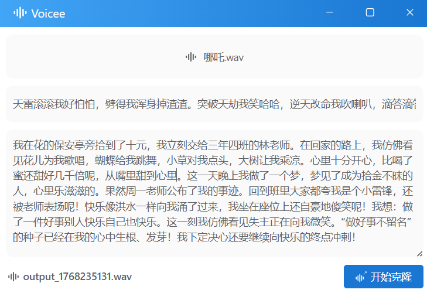

<div align="center">


</div>

# Voicee

音色克隆工具。

模型使用`voxcpm`，[aha](https://github.com/jhqxxx/aha)推理库实现。

客户端基于Tauri开发。

支持的系统：

- Windows ✅
- Ubuntu ✅
- MacOS ⚠️

支持CPU和英伟达的GPU。

> ⚠️：理论上支持，但未测试。

# 安装

前往 [发布页面](https://github.com/xgpxg/voicee/releases) 下载对应版本安装即可。

发布版使用CUDA12.6编译，如果和你的版本不匹配，可参考下方自行编译。

# 编译

```shell
# 克隆仓库
git clone https://github.com/xgpxg/voicee.git
cd voicee

# 安装依赖
npm install

# 开发模式启动
npm run tauri dev

# 打包应用
npm run tauri build

# 启用CUDA(可选)
npm run tauri build -- --features cuda
```

> Node >= 20

# 示例结果

- 原始音频：[哪吒](https://github.com/xgpxg/voicee/blob/master/docs/audio/%E5%93%AA%E5%90%92.wav)

- 生成结果：[输出](https://github.com/xgpxg/voicee/blob/master/docs/audio/%E5%85%8B%E9%9A%86.wav)

# 截图



